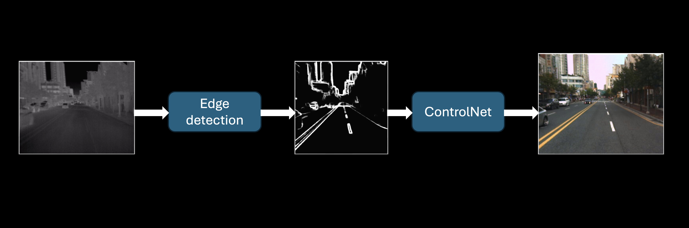
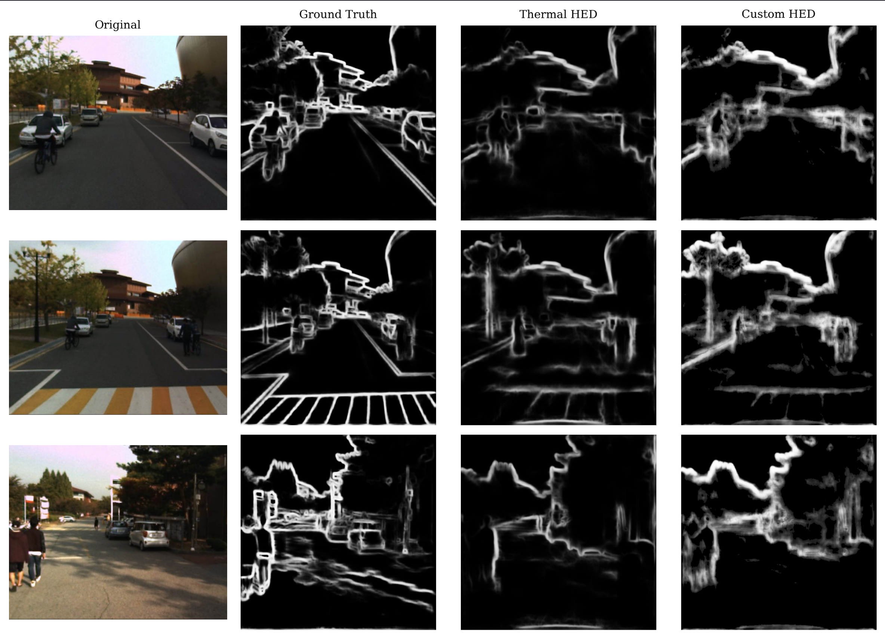

# Thermal Image Reconstruction Pipeline
 
> Bridging the domain gap between visible-light (VL) and infrared (IR) imagery using ControlNet-conditioned Stable Diffusion.
 
This project improves the interpretability of thermal images through a custom-trained edge detection network and textual inversion module, targeting practical applications such as **low-light surveillance** and **autonomous vehicles**.
 

 
---
 
## Overview
 
The pipeline combines two key components:
 
- **Custom HED model** — a fine-tuned Holistically-Nested Edge Detection network adapted for thermal imagery, used to condition image generation via ControlNet.
- **Textual Inversion module** — a ControlNet-compatible token trained to guide Stable Diffusion in reconstructing realistic scene content from thermal inputs.
Together, these enable an end-to-end translation from raw thermal images to perceptually meaningful reconstructions.
 
---
 


## Getting Started
 
### Prerequisites
 
- Python 3.11
### Installation
 
Clone the repository and set up a virtual environment:
 
```bash
git clone <repository-url>
cd <repository-name>
 
python3.11 -m venv .venv
source .venv/bin/activate        # On Windows: .venv\Scripts\activate
 
pip install -r requirements.txt
```
 
### Running the Pipeline
 
The evaluation pipeline is invoked via `tools/evaluation_pipe.py`:
 
```bash
python -m tools.evaluation.pipe \
    --input_file <path_to_image_file> \
    --output_dir <path_to_output_directory>
```
 
Results are saved as `.png` files in the specified output directory.

---
 
## Training
 
### Edge Detection — Custom HED Model
 
The HED network was fine-tuned on thermal imagery to reduce:
 
- Focal loss
- Boundary IoU loss
- DICE loss

| Component | Path |
|---|---|
| Training script | `src/preprocess/train_hed_thermal.py` |
| Dataloader | `tools/dataloader.py` |
| Saved weights | `weights/hed_thermal.pth` |
 

 
### Scene Reconstruction — Textual Inversion
 
A custom token was trained to capture scene semantics for Stable Diffusion prompting, enabling ControlNet to reconstruct thermal scenes coherently.
 
| Component | Path |
|---|---|
| Training script | `src/reconstruction_module/text_inversion.py` |
| Saved token | `weights/custom_tokens.pt` |
 
---
 
## Project Structure
 
```
.
├── readme.md
├── requirements.txt
├── src
│   ├── baseline
│   │   ├── edge_detector_hed.py
│   │   └── reconstruction_hed.py
│   ├── preprocess
│   │   ├── base_hed.py
│   │   ├── edge_detector_custom_hed.py
│   │   └── train_hed_thermal.py
│   └── reconstruction_module
│       ├── text_inversion.py
│       ├── token_reconstruction.py
│       └── train_prompt.py
├── tools
│   ├── dataloader.py
│   └── evaluation_pipe.py
└── weights
```

(key repository structure)

---
 
## References
 
- **ControlNet** — Adding Conditional Control to Text-to-Image Diffusion Models, [zhang et al](https://arxiv.org/abs/2302.05543)
- **Textual Inversion** — An Image is Worth One Word: Personalizing Text-to-Image Generation using Textual Inversion [gal et al](https://arxiv.org/abs/2208.01618)
- **Holistically-Nested Edge Detection (HED)** — Holistically-Nested Edge Detection, [Xie & Tu](https://arxiv.org/abs/1504.06375)
- **Base HED Model** — [snikklaus](https://github.com/sniklaus/pytorch-hed)